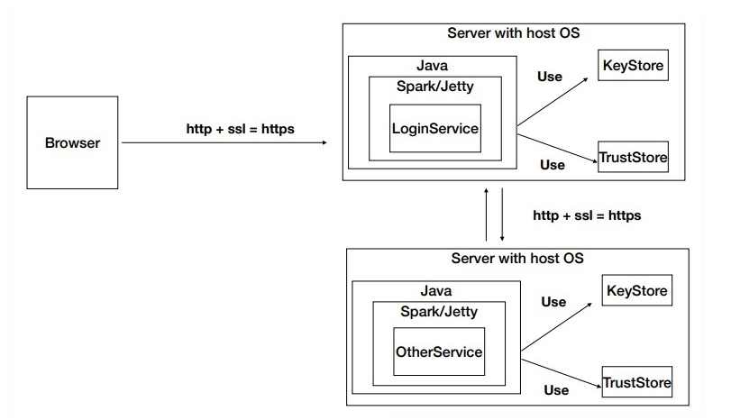

# APLICACIÓN DISTRIBUIDA SEGURA EN TODOS SUS FRENTES
### Daniel Santiago Ducuara Ardila
### 10/10/2021

## EJERCICIO
Desarrolle una aplicación Web segura con los siguientes requerimientos:

Debe permitir un acceso seguro desde el browser a la aplicación. Es decir debe garantizar autenticación, autorización e integridad de usuarios.
Debe tener al menos dos computadores comunicacndose entre ellos y el acceso de servicios remotos debe garantizar: autenticación, autorización e integridad entre los servicios. Nadie puede invocar los servicios si no está autorizado.
Explique como escalaría su arquitectura de seguridad para incorporar nuevos servicios.

## Arquitectura
 

Se tiene una clase java LoginService, para acceder a los servicios es necesario obtener una llave que permita la autenticación para ingresar y acceder a
los servicios.

## Diagrama de clases

 
La clase loginService se encarga de obtener los parámetros de entrada del usuario y contraseña, inicia la clase URLReader y envía
los parámetros, se crea la conexión a la url para que se genere la respuesta, al finalizar el proceso se muestra la respuesta generada
si pasa el proceso de autenticación del login.

Para comprobar iniciar la clase LoginService y en el navegador colocar lo siguiente:

Iniciar clase LoginService por consola: 
java -cp "target/classes;target/dependency/*" edu.escuelaing.arep.secureappspark.LoginService 
Navegador: 
https://localhost:4567/loginUser?user=nombreUsuario&passwd=contraseñaUsuario

 

Para escalar la arquitectura se seguridad para incorporar nuevos servicios es importante una generación de llaves del usuario para que 
pueda acceder a dichos servicios, una vez finalice el uso de los servicios si quiere acceder nuevamente se generarán llaves que cambiarán 
con el tiempo.

A continuación, se presentarán los comandos usados para la creación, exportación de llaves y certificados.

Crear llaves:

keytool -genkeypair -alias ecikeypair -keyalg RSA -keysize 2048 -storetype PKCS12 -keystore ecikeystore.p12 -validity 3650

Exportar llaves:

keytool -export -keystore ./ecikeystore.p12 -alias ecikeypair -file ecicert.cer

Importar certificado:

keytool -import -file ./ecicert.cer -alias firstCA -keystore myTrustStore

